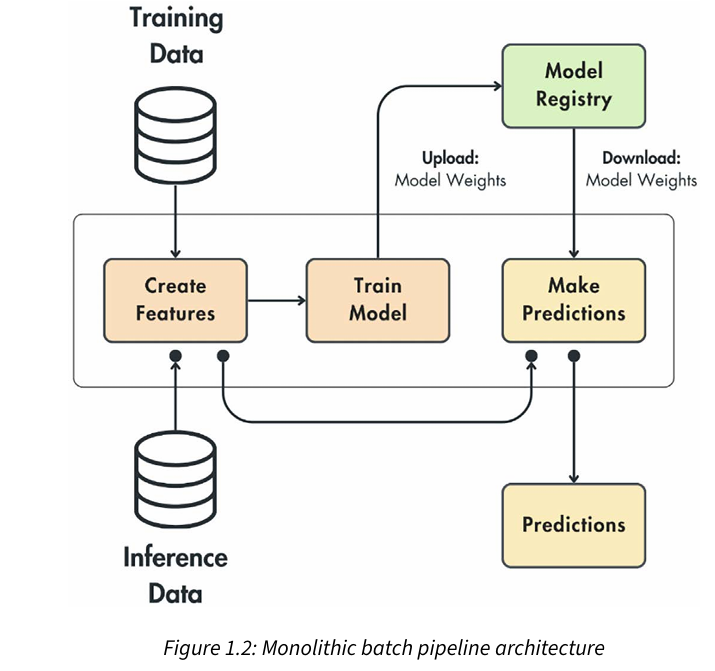
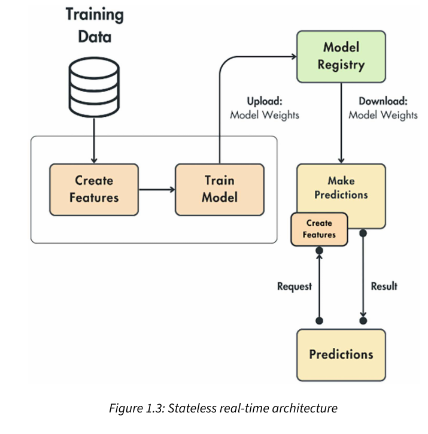
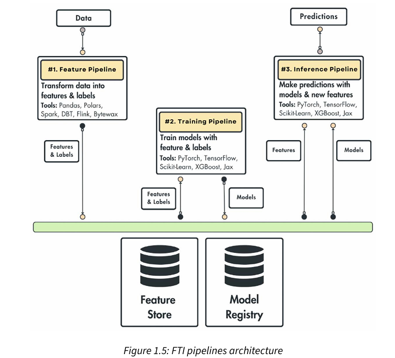
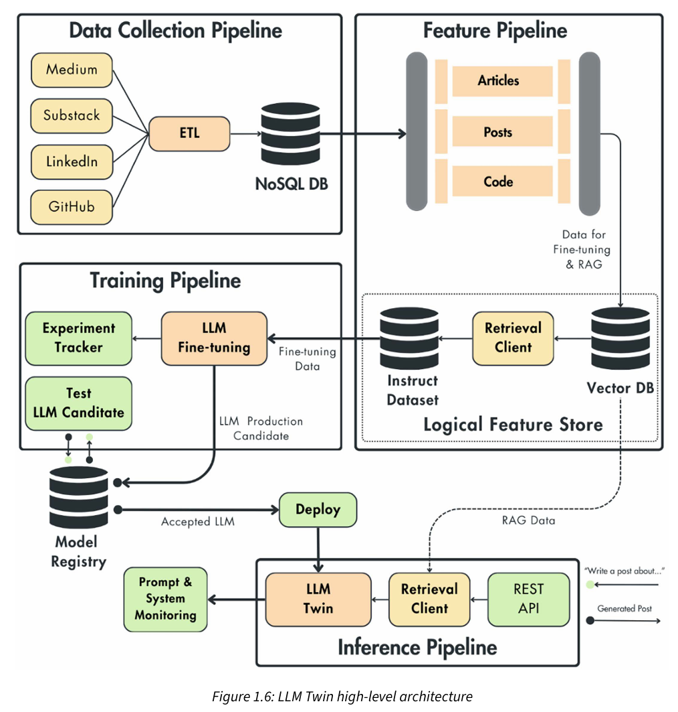

# 1. Understanding the LLM Twin  Concept and Architecture
目标：构建一个端到端的LLM产品

产品：构建一个LLM孪生(LLM Twin,  an AI character that learns to write like a particular 
person by incorporating its style, voice, and personality into an LLM)

收获：了解ML应用的完整生命周期，包括数据收集(data gathering), 模型部署和监控(deployment and monitorinng)

产品实现步骤：

1. 要解决什么问题？ 我们要实现什么？ （提出what和why）
2. 产品有哪些核心特征， 回答“What are we going to build?"
3. 系统设计：产品的架构和设计选择，回答How

## 1.1 理解LLM Twin 概念
第一步就是要对我们想要创造的产品和它的价值有一个清晰的认知(clear vision)

我们先认识LLM Twin: 我们对它有什么期待？它如何工作？

基于对最终产品目标的solid intuition, 才知道我们需要哪些设计决策、哪些技术、哪些基础设施

### 1.1.1 What is an LLM Twin?
LLM Twin is an LLM Twin is an AI character that incorporates your writing style, voice, and  personality into an LLM, which is a complex AI model. It is a digital version of yourself projected into an LLM.

Instead of a generic LLM trained on the whole internet, an LLM Twin is fine-tuned 
on yourself.

Naturally, as an ML model reflects the data it is trained on, this LLM will incorporate  your writing style, voice, and personality.

It is essential to understand that an LLM reflects the data it was trained on. If you feed it Shake speare, it will start writing like him.

因此需要基于个人的一些数据来微调LLM，让其成为我们的数字孪生体

Here are some scenarios of what you can fine-tune an LLM on to become your twin:
 - LinkedIn posts and X threads: Specialize the LLM in writing social media content.
 - Messages with your friends and family: Adapt the LLM to an unfiltered version of yourself.
 - Academic papers and articles: Calibrate the LLM in writing formal and educative content.
 - Code: Specialize the LLM in implementing code as you would

但是收集使用数据也是难点：

1. 如何访问这些数据
2. 是否有足够的个人数据来微调LLM
3. 哪些数据有价值？

### 1.1.2 为什么构建LLM Twin很重要(Why building an LLM Twin matters)
1. 帮助建立个人品牌(personal brand), 替我们在各个平台发表内容，节省时间

why does building an LLM Twin matter? It helps you do the following:
 - Create your brand
 - Automate the writing process
 - Brainstorm new creative ideas

### 1.1.3 Why not use ChatGPT (or another similar chatbot)?
ChatGPT is not personalized to your writing style and voice. 
Instead, it is very generic, unarticulated, and wordy. Maintaining an original voice is critical for long-term success when building your brand. Thus, directly using ChatGPT or Gemini will not yield the most optimal results.

另外使用ChatGPT还面临以下问题：
1. Misinformation due to hallucination： Manually checking the results for hallucinations or using third-party tools to evaluate your results is a tedious and unproductive experience.
2. Tedious manual prompting: You must manually craft your prompts and inject external 
information, which is a tiresome experience

LLM Twin的关键点如下：

- 收集什么数据？
- 如何预处理数据？
- 如何将数据喂给LLM?
- 如何将多个提示串联以获得理想结果（How we chain multiple prompts for the desired results）
- 如何评测生成的内容？

LLM系统可以自动化以下步骤：

- 数据收集
- 数据预处理
- 数据存储、版本管理、检索
- LLM微调
- RAG
- 内容生成和评测

The key to most successful ML products is to be data-centric and make your architecture model-agnostic. Thus, you can quickly experiment with multiple models on your specific data.

## 1.2 Planning the MVP of the LLM Twin product

### 1.2.1 What iis an MVP?
minimum viable product (MVP): 以最基础的产品特征满足市场需求和商业目标， 即产品可行(V)是基础，有最基础的端到端可使用功能，让用户对产品有一个好的用户体验，并对产品演进和完整的功能有一个期待

An MVP is a powerful strategy because of the following reasons:
- Accelerated time-to-market: Launch a product quickly to gain early traction
- Idea validation: Test it with real users before investing in the full development of the product
- Market research: Gain insights into what resonates with the target audience
- Risk minimization: Reduces the time and resources needed for a product that might not achieve market success

### 1.2.2  Defining the LLM Twin MVP
Our goal is simple: we want to maximize the product’s value relative to the effort and resources poured into it

To keep it simple, we will build the features that can do the following for the LLM Twin:

- Collect data from your LinkedIn, Medium, Substack, and GitHub profiles
- Fine-tune an open-source LLM using the collected data
- Populate a vector database (DB) using our digital data for RAG
- Create LinkedIn posts leveraging the following：
  - User prompts
  - RAG to reuse and reference old content
  - New posts, articles, or papers as additional knowledge to the LLM
- Have a simple web interface to interact with the LLM Twin and be able to do the following:
  - Configure your social media links and trigger the collection step
  - Send prompts or links to external resources

That will be the LLM Twin MVP. Even if it doesn’t sound like much, remember that we must make this system cost effective, scalable, and modular.

## 1.3 Building ML systems with feature/training/inference pipelines
前面从用户和商业视角看待如何构建LLM Twin, 最后一步是从工程角度进行审视，并制定一个开发计划，以了解如何在技术层面上解决这一问题。从现在开始，将重点关注 LLM Twin 的实现。

FTI pipelines(Feature/training/inference)是ML系统的核心

### 1.3.1 The problem with building ML systems
Types of problems an ML or MLOps enginner must consider:
 - Ingest, clean, and validate fresh data
 - Training versus inference setups
 - Compute and serve features in the right environment
 - Serve the model in a cost-effective way
 - Version, track, and share the datasets and models
 - Monitor your infrastructure and models
 - Deploy the model on a scalable infrastructure
 - Automate the deployments and training

ML system common elements(from google cloud team):
- ML code
- configuration
- automation
- data collection
- data verification
- testing and debugging
- resource management
- model analysis
- process management
- metadata management
- serving infrastructure
- monitoring

Question: 如何将这么多组件集成到单个系统中？

类似解决方案就是分层架构： DB, 应用逻辑，UI

### 1.3.2 Monolithic batch pipeline architecture

该架构中feature creation, model training, inference都在相同的组件中，训练数据和推理数据特征提取是一致的，解决了ML系统的training-serving skew问题；

存在的问题：
- 特征无法复用
- 如果数据规模增加，得重构代码支持对大数据量的处理，比如要适配PySpark或Ray
- 无法支持实时训练所需的流处理功能
- 特征提取、模型训练、推理模块无法跨团队共享

### 1.3.3 Stateless real-time architecture

该架构可以处理实时场景，但是存在的问题是要进行预测时，客户端必须把请求的整个状态都传到预测模块进行特征提取，然后进行预测，比如对于电影推荐，就要把用户id,性别，观影历史等等数据和请求一起发送到预测模块。

而我们所需的解决方案是：客户端不需要知道预测模块进行特征提取的细节，也就不需要在请求中传输过多状态，比如电影推荐，只需要传输用户ID，其它特征信息由预测模块自己获取处理

### 1.3.2 The solution - ML pipelines for ML systems

FTI pipeline pattern for ML system，即将ML系统分成三个pipelines: Feature, training, inference,
可以很清晰的定义每个pipeline的范围、它们之间的接口、理清它们之间交互方式。每个pipeline都是不同的组件，可以运行在不同的环境中，即每个pipeline都是一个独立的微服务。

#### feature pipeline
- 接受原始数据进行处理得到特征和标签
- 特征和标签数据保存到feature store， 进行version, trace, share管理
- training pipeline和inference pipeline可以从feature store获取所需数据

#### training pipeline
- 从feature store获取特征、标签数据进行训练
- 模型存储
- 模型训练元数据存储（比如特征、标签的版本）

#### inference pipeline
- 获取特征、标签、模型
- 同时支持batch和real-time模式
- 支持基于模型元数据（特征版本、标签版本、模型版本）回退或者升级模型

#### Benefits of the FTI architecture

To conclude, the most important thing you must remember about the FTI pipelines is their in
terface:
- The feature pipeline takes in data and outputs the features and labels saved to the feature 
store.
- The training pipeline queries the features store for features and labels and outputs a 
model to the model registry.
- The inference pipeline uses the features from the feature store and the model from the 
model registry to make predictions.

It doesn’t matter how complex your ML system gets, these interfaces will remain the same.

Now that we understand better how the pattern works, we want to highlight the main benefits 
of using this pattern:
- As you have just three components, it is intuitive to use and easy to understand.
- Each component can be written into its tech stack, so we can quickly adapt them to specific needs, such as big or streaming data. Also, it allows us to pick the best tools for the job.
- As there is a transparent interface between the three components, each one can be de
veloped by a different team (if necessary), making the development more manageable 
and scalable.
- Every component can be deployed, scaled, and monitored independently.
 
The final thing you must understand about the FTI pattern is that the system doesn’t have to 
contain only three pipelines. In most cases, it will include more.

The FTI pipelines act as logical layers. Thus, it is perfectly fine for each to be complex and contain multiple services.

To learn more about the FTI pipeline pattern, consider reading From MLOps to ML 
Systems with Feature/Training/Inference Pipelines by Jim Dowling, CEO and co-founder 
of Hopsworks: https://www.hopsworks.ai/post/mlops-to-ml-systems-with
fti-pipelines. His article inspired this section

## 1.4 Designing the system architecture of the LLM Twin
high-level architecture is language-, framework-, platform-, and infrastructure-agnostic,
only focus on each component's scope, interface and interconnectivity.

### 1.4.1 Technical details of the LLM Twin architecture
- data side:
   - Collect data from LinkedIn, Medium, Substack, and GitHub completely autonomously and on a schedule
   - Standardize the crawled data and store it in a data warehouse
   - Clean the raw data
   - Create instruct datasets for fine-tuning an LLM
   - Chunk and embed the cleaned data. Store the vectorized data into a vector DB for RAG

- training:
  - Fine-tune LLMs of various sizes (7B, 14B, 30B, or 70B parameters)
  - Fine-tune on instruction datasets of multiple sizes
  - Switch between LLM types (for example, between Mistral, Llama, and GPT)
  - Track and compare experiments
  - Test potential production LLM candidates before deploying them
  - Automatically start the training when new instruction datasets are available

- inference:
  - A REST API interface for clients to interact with the LLM Twin
  - Access to the vector DB in real time for RAG
  - Inference with LLMs of various sizes
  - Autoscaling based on user requests
  - Automatically deploy the LLMs that pass the evaluation step.

- system support LLMOps features:
  - Instruction dataset versioning, lineage, and reusability
  - Model versioning, lineage, and reusability
  - Experiment tracking
  - Continuous training, continuous integration, and continuous delivery (CT/CI/CD)
  - Prompt and system monitoring

#### 1.4.2 How to design the LLM Twin architecture using the FTI pipeline design
四个核心组件：
1. Data pipeline:
   1. Crawling data from social media
   2. ETL: extract, standardize, load into data warehouse
2. Feature pipeline
   1. 三种数据类型：take raw articles, posts and code from data warehouse in data pipeline
   2. 三种处理步骤(为了fine-tuning和RAG): cleaning, chunking, and embedding
   3. It creates two snapshots of the digital data, one after cleaning (used for fine-tuning) and one after embedding (used for RAG)
   4. It uses a logical feature store instead of a specialized feature store
   5. training pipeline and inference pipeline can access feature store

3. Training pipeline
   1. consume instruct datasets from the feature store
   2. fine-tuning LLM
   3. store the tuned LLM weights in a model registry
   4. 微调过程的跟踪记录和新模型分布前的测试
   5. continuous training when new instruct dataset are available
   6. The particularities of this component will be on LLM aspects, such as the following:
       - How do you implement an LLM agnostic pipeline?
       - What fine-tuning techniques should you use?
       - How do you scale the fine-tuning algorithm on LLMs and datasets of various sizes?
       - How do you pick an LLM production candidate from multiple experiments?
       - How do you test the LLM to decide whether to push it to production or not？
 
4. Inference pipeline
   1. load fine-tuned LLM from model registry
   2. access knowledge for RAG from logical feature store
   3. provide REST API for client
   4. prompt and system monitoring for analyze, debug and better understand system
   5. retrieval client/prompt templates/prompt monitor tools

