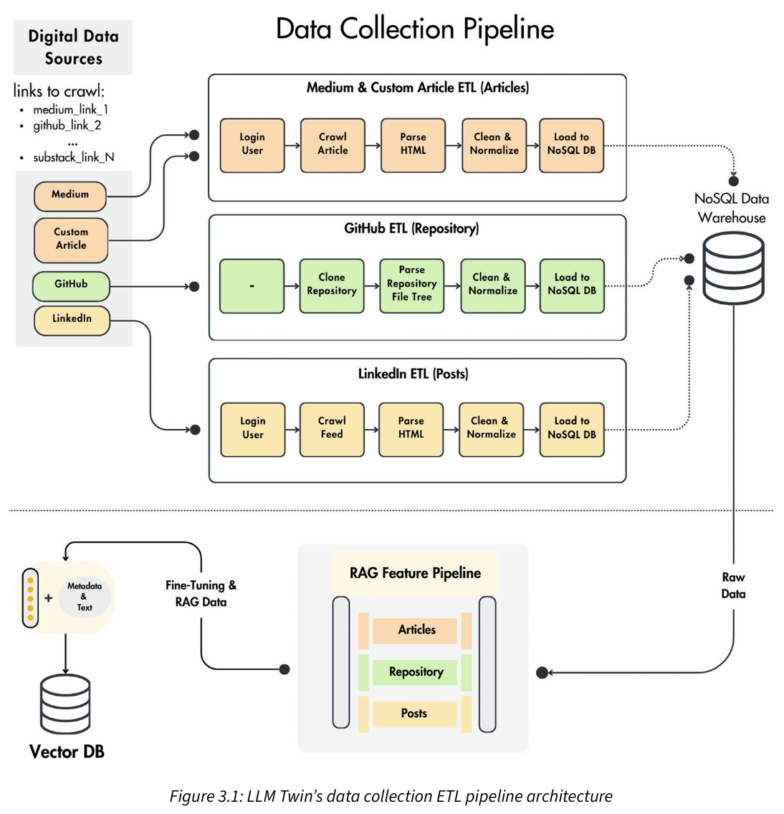
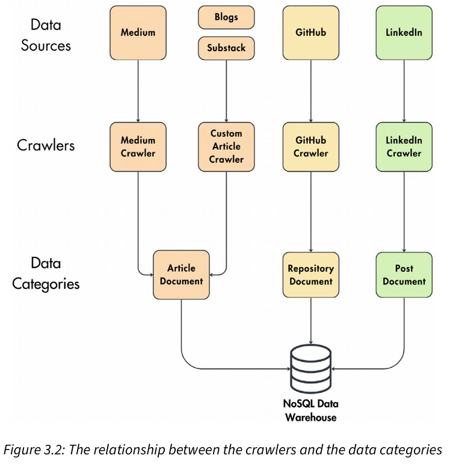
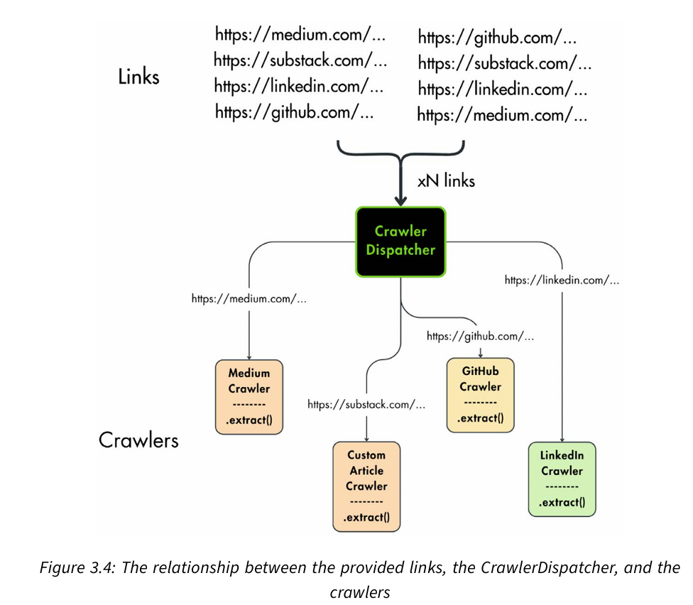

# How to design and implement data collection pipeline

## Data collection ETL Pipeline architecture

1. Data resources
   1. medium, substack, github, linkedin
2. ETL pipeline steps
   1. Extract: We extract data from various sources. We will crawl data from platforms like Medium,Substack, and GitHub to gather raw data.
   2. Transform: We transform this data by cleaning and standardizing it into a consistent format suitable for storage and analysis.
   3. Load: We load the transformed data into a data warehouse or database.
3. Data Warehouse:
   1. use MongoDB as NoSQL data warehouse
4. Input of data collection pipeline:
   1. A list of links and their associated user (the author)
5. Output of data collection pipeline:
   1. A list of raw documents stored in the NoSQL data warehouse

### crawlers and data categories


By reducing all the collected data to three data categories and not creating a new data category for every new data source, we can easily extend this architecture to multiple data sources with minimal effort.

Otherwise, if we introduced the source dimension in the class and document structure, we would have to add code to all downstream layers to support any new data source. For example, we would have to implement a new document class for each new source and adapt the feature pipeline to support it.

### How is the ETL process connected to the feature pipeline? 
The two pipelines communicate with each other strictly through the MongoDB data warehouse.

The feature pipeline ingests the raw data from the MongoDB data warehouse, cleans it further, processes it into features, and stores it in the Qdrant vector DB to make it accessible for the LLM training and inference pipelines.

### Why did we use MongoDB as a data warehouse?
1. in our use case, we are working with small amounts of data, which MongoDB can handle.
2. Picked MongoDB to store our raw data primarily because of the nature of our unstruc
tured data: text crawled from the internet. By mainly working with unstructured text, selecting a NoSQL database that doesn’t enforce a schema made our development easier and faster. 
3. Also, MongoDB is stable and easy to use. Their Python SDK is intuitive. They provide a Docker image that works out of the box locally and a cloud freemium tier that is perfect for proofs of concept, such as the LLM Twin.
4. However, when working with big data (millions of documents or more), using a dedicated data warehouse such as Snowflake or BigQuery will be ideal.

## Implementing the LLM Twin’s data collection pipeline

The entry point to each pipeline from our LLM Twin project is a 
ZenML pipeline, which can be configured at runtime through YAML files and run through the ZenML ecosystem. 

### 1. ZenML pipeline and steps
1. 利用ZenML系统实现pipeline和steps，并调度管理Pipeline执行， Pipeline和steps实现和项目业务逻辑分离，方便替换其它平台，只需要修改Pipeline和steps，不需要修改业务逻辑, 像crawling logic属于业务逻辑，steps中调用这些业务逻辑实现。
2.  ZenML orchestrates the data collection pipeline. Thus, leveraging ZenML, the data collection pipeline can be run manually, scheduled, or triggered by specific events.

### 2. dispatcher


The dispatcher acts as the intermediate layer between the provided links and the crawlers.  The CrawlerDispatcher class knows how to extract the domain of each link and initialize the proper crawler that collects the data from that site.


### 3. The crawlers
- 不同平台实现不同的crawlers
- 实现一个通用的crawlers作为fallback

### 4. The NoSQL data warehouse documents
Modeled the data categories as the following document classes
- ArticleDocument class
- PostDocument class
- RepositoryDocument class

These are not simple Python data classes or Pydantic models. They support read and write oper ations on top of the MongoDB data warehouse. To inject the read-and-write functionality into all the document classes without repeating any code, we used the Object-Document Mapping (ODM) software pattern, which is based on the object-relational mapping (ORM) pattern.

#### The ORM and ODM software patterns
ORM is a technique that lets you query and manipulate data from a database using an object-oriented paradigm. Instead of writing SQL or API-specific queries, you encapsulate all the complexity under an ORM class that knows how to handle all the database operations, most commonly CRUD operations. Thus, working with ORM removes the need to handle the database operations manually and reduces the need to write boilerplate code manually. An ORM interacts with a SQL database, such as PostgreSQL or MySQL.

Most modern Python applications use ORMs when interacting with the database. Even though SQL is still a popular choice in the data world, you rarely see raw SQL queries in Python backend components. The most popular Python ORM is SQLAlchemy (https://www.sqlalchemy.org/).  Also, with the rise of FastAPI, SQLModel is (https://github.com/fastapi/sqlmodel) a common choice, which is a wrapper over SQLAlchemy that makes the integration easier with FastAPI.

example code in code_snippets/03_orm.py

The ODM pattern is extremely similar to ORM, but instead of working with SQL databases and tables, it works with NoSQL databases (such as MongoDB) and unstructured collections. As we work with NoSQL databases, the data structure is centered on collections, which store JSON-like documents rather than rows in tables.

#### Implementing the ODM class
ODM simplifies working with document-based NoSQL databases and maps object-oriented code to JSON-like documents.
- base ODM class called NoSQLBaseDocument

### Gathering raw data into the data warehouse
```python
# Call the data collection pipeline to collect Maxime’s 
# data, for example, you can run the following CLI command
poetry poe run-digital-data-etl-maxime
```